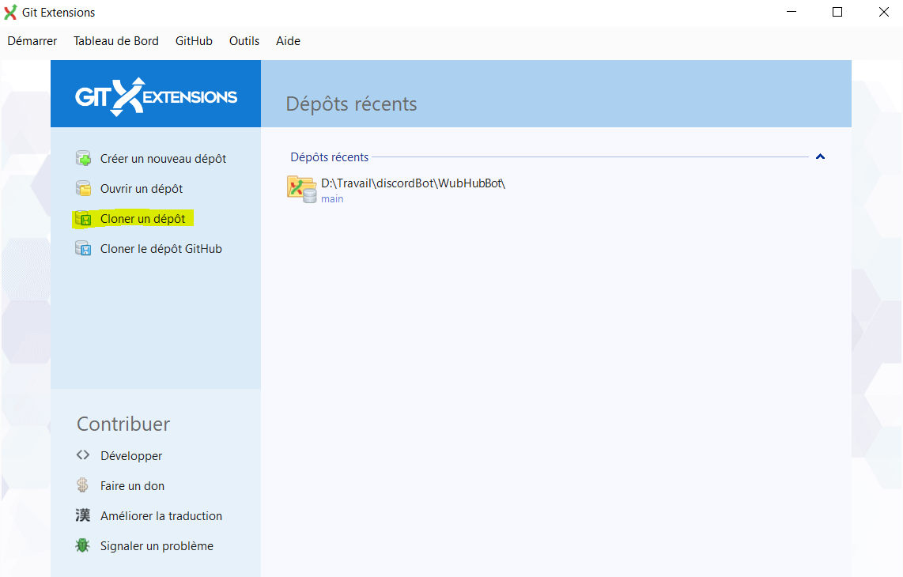
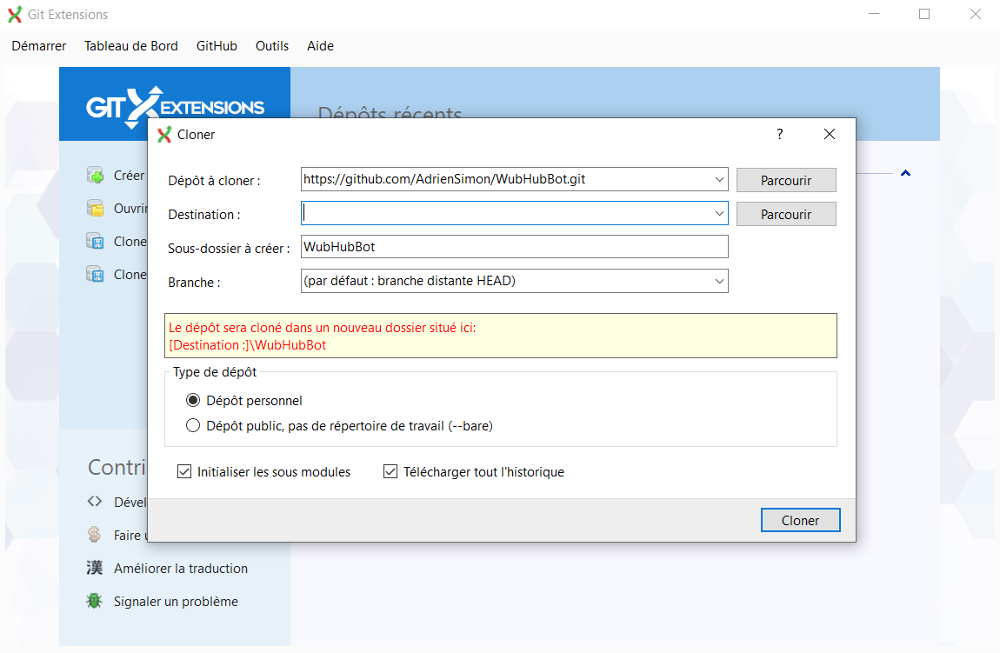

# WubHubBot


## Pour commencer

### 1) Créer un bot discord pour vos propres tests

*pour éviter de se marcher dessus en voulant tester le code du bot, il est plus simple d'avoir
chacun son propre bot et serveur de test*

- Visitez https://discord.com/developers/applications en étant connecté
sur la version web de Discord pour pouvoir créer votre bot

- Créez votre propre serveur discord et invitez-y votre bot

*Il y a plein de tuto en ligne donc flemme d'expliquer + mais n'hésitez pas à demander*


- sauvegardez le token de votre bot dans un fichier appelé token.json sous la forme: 

````json
{
  "token": "XXXXXXXXXXXXXXXXXXXXXXXXXXXX"
}
````


### 2) Installer nodeJS

visitez https://nodejs.org/en/ et choisissez d'installer la version Current


### 3) récupérer les sources du projet

Vous pouvez récupérer les sources du projet directement avec Git en ligne de commande ou vous aider de GitExtension:

- Cloner un dépot avec gitExtension



- l'adresse du dépot à cloner est __https://github.com/AdrienSimon/WubHubBot.git__
- choisissez un dossier de destination sur votre PC cliquez sur **cloner**



toutes les sources du projet ont maintenant été téléchargé dans le dossier spécifié

### 4) Installer les dépendances du projet

en ouvrant un CMD à la racine du projet, utilisez la commande:

`npm install`

- *note: npm est un gestionnaire de paquet installé avec NodeJS, la commande 
ci-dessus se sert du fichier __package.json__ pour aller chercher les dépendances du projet
et les télécharger dans un dossier appelé __npm_modules__. 
Ce dossier est ignoré par git afin d'éviter d'alourdir le dépot git, ainsi, chaque
développeur doit télécharger les dépendances du projet après avoir cloné le projet
sur son PC*

### 5) Lancer le bot !

Avant de pouvoir démarrer le bot, copiez le fichier token.json contenant le token
de votre bot à la racine du projet

*ce fichier est ignoré par git et ne sera pas poussé sur le dépot, il est nécessaire afin que le bot puisse se connecter*

pour démarrer le bot, allez à la racine du projet et utilisez la commande
`node index.js`


# Voilà !